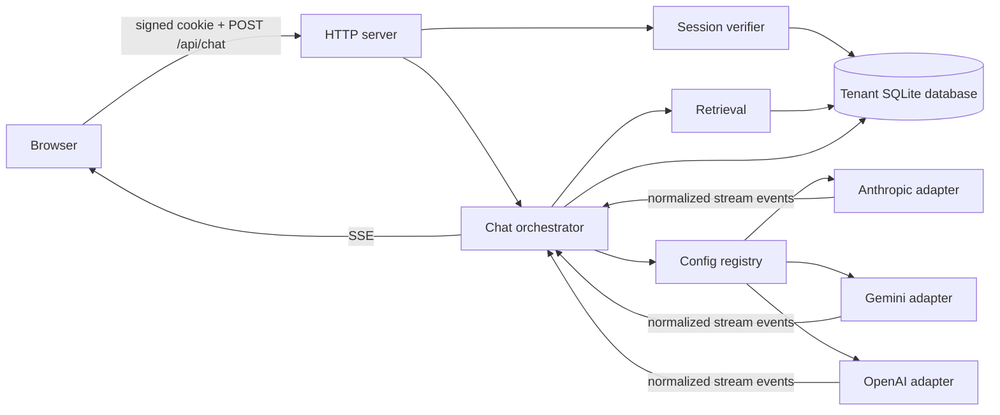

# Polyglot Design

## Request flow

The browser sends a message and selected model over a POST request. The server verifies the signed session, opens only that tenant's database, persists the user turn, and optionally retrieves chunks from a selected collection. The chat orchestrator sends provider-agnostic messages to the configured adapter, forwards text and tool events over SSE, persists the answer, and records one usage row for each upstream request.

## Provider boundary

The contract follows the assignment's message, content block, tool, stream event, and error shapes. `src/providers/registry.mjs` reads `config/providers.json` and dynamically imports the configured adapter. No provider-specific branching occurs in chat, retrieval, or the UI. Vendor roles, tool schemas, system placement, streamed deltas, usage fields, and HTTP errors are converted inside each adapter.

To add a provider, write `src/providers/adapters/<name>.mjs` and add one object under `providers` in `config/providers.json`. Include its model IDs, context windows, capability flags, and prices there. An embedding-capable adapter may also implement `embed`. The provider test should use mocked HTTP frames for text, tools, usage, and an error response. No other production file needs changing.

## Tenant isolation model

1. **Identity source:** the local demo login maps one of two usernames to a tenant on the server and issues an HMAC-signed, expiring, HttpOnly cookie. Endpoints do not accept a tenant ID from a header, query string, or JSON body.
2. **Forgery:** a caller cannot edit the tenant ID in an existing cookie without invalidating its signature. The published demo passwords let a reviewer sign into either test account, so this is an isolation demonstration rather than production authentication.
3. **Enforcement:** `tenantDb` resolves the verified tenant to a hashed filename beneath the private `data/tenants` directory. Every route receives this tenant-specific connection. Each database contains only its tenant's conversations, documents, chunks, and usage records. A new query on that connection cannot accidentally return another tenant's rows by omitting a predicate. Foreign resource IDs resolve to 404. Database files are not served by the static route.
4. **Leak detection:** the test suite checks cross-tenant database queries, foreign conversation IDs, chunk IDs, and session tampering. Before production, add structured access logs with tenant, actor, resource, and request IDs, plus canary records and alerts for cross-tenant resource attempts. The take-home does not claim historical leak detection from its local logs.

The process owner can deliberately open any local database file; this design protects against accidental cross-tenant queries, not a compromised server process. Production deployments should use real authentication, per-tenant authorization, and database-level isolation or PostgreSQL row-level security with separate runtime/migration roles.

## Decisions

1. **Use Node's built-in HTTP and SQLite modules.** This keeps startup to one Node command and leaves the adapter code visible. A framework would reduce routing boilerplate but add dependencies and hide less of the problem being assessed.
2. **Keep the browser UI plain JavaScript.** The interface is small, and build tooling would add setup time without changing the provider or tenant design.
3. **Use a normalized stream event union.** The orchestrator can handle text, tool arguments, usage, completion, and errors without parsing vendor payloads.
4. **Physically separate tenant databases.** This makes an omitted SQL filter harmless for ordinary data access. A single shared SQLite database with manual `tenant_id` conditions would rely too heavily on developer discipline.
5. **Use a signed demo session.** A caller cannot select another tenant by changing a request header. Real authentication is intentionally deferred, as the brief permits.
6. **Reject oversized context.** A conservative preflight estimate and normalized provider context errors produce an explicit user message. Summarization could distort prior turns and would need its own evaluation.
7. **Use exact cosine retrieval.** Upload and chunk caps make a simple tenant-local scan practical and easy to inspect. Index changes rebuild stored source text atomically.
8. **Retry only safe pre-output failures.** Rate-limit and server errors receive bounded exponential backoff with jitter. Once text or tool data has reached the browser, retry/fallback could duplicate or contradict an answer, so the error is surfaced.
9. **Derive cost from config and provider usage.** Cached input is priced separately when reported. A missing usage field stays unknown instead of being invented.

## Security posture and limits

Inputs are length-checked; uploads are limited to 2 MB, validated by type and PDF magic bytes, and capped after extraction to 60,000 characters and 50 chunks, with at most 20 documents per collection. A chat request is capped at 80,000 characters of context. The calculator parses arithmetic rather than evaluating code. Weather requests go only to fixed Open-Meteo hosts. Provider keys remain server-side in `.env`; raw provider errors are retained only on server error objects and not serialized to the browser. The HTTP server binds to loopback; sessions use HttpOnly and SameSite cookies, and write requests check the `Origin` header. Provider calls have output-token and time limits, and tool loops are bounded.

Retrieved document text is escaped and framed as untrusted source data in a system instruction; it is never turned into a tool definition or executed. This reduces prompt-injection risk but is not a proof that a model will ignore every malicious document. A generated document answer without a valid retrieved citation marker is replaced with an "I don't know" response. Citations are presented with their exact retrieved chunk so reviewers can inspect the evidence. Before production, add citation entailment checks, malware scanning and OCR policy for uploads, real authentication, audit logging, database backup/encryption, and stronger cost controls per tenant.

With more time, I would first add an automated citation-grounding evaluator and then move tenant storage to PostgreSQL with row-level security, per-tenant quotas, and request tracing.
